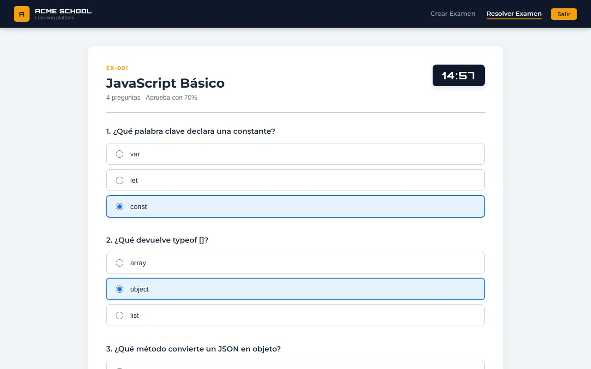
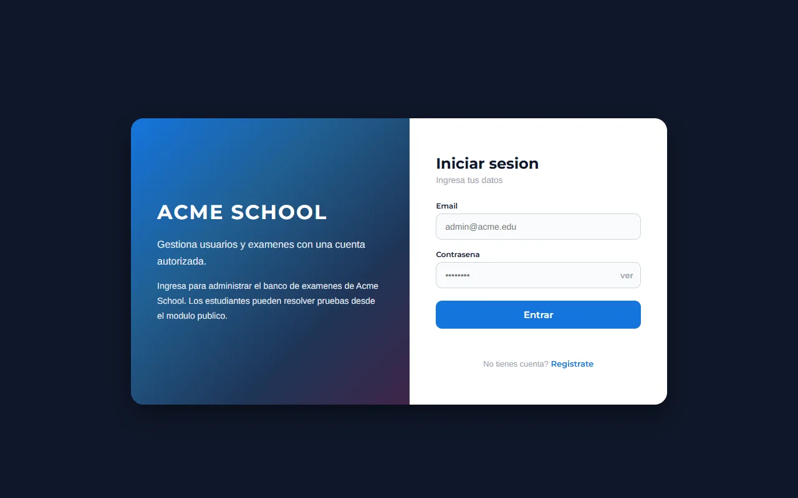
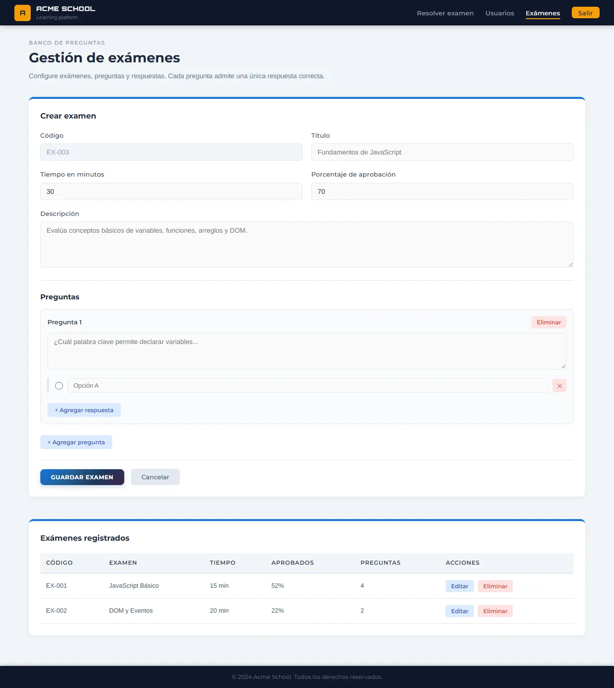
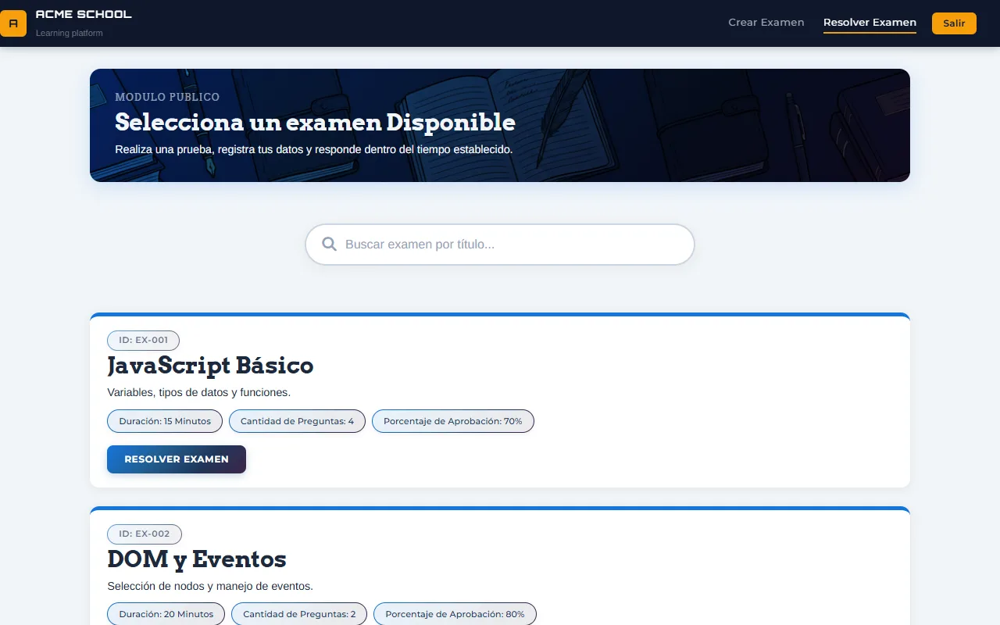
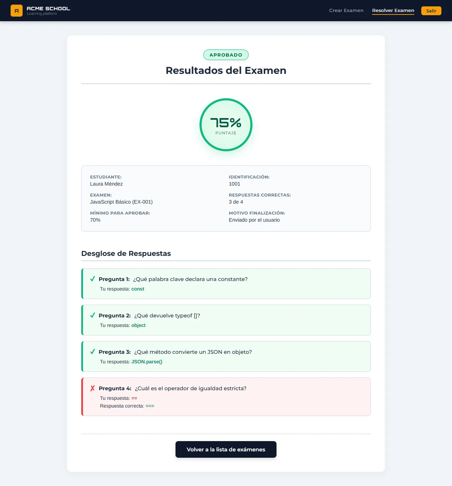
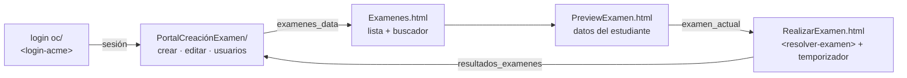

# ACME School — plataforma de exámenes

Aplicación web en **JavaScript puro**, sin frameworks, para **crear exámenes** y **resolverlos con cuenta atrás**. Tiene inicio de sesión, gestión de usuarios y calificación automática con desglose de respuestas.

Esta es la **versión documentada**: el mismo proyecto que [`ProyectoJavaScript`](https://github.com/Eidan210/ProyectoJavaScript), con más de 200 comentarios que explican cada decisión del código y ajustes de refactorización. La versión con informe de estadísticas y prueba unitaria está en [`ExamenJS`](https://github.com/Eidan210/ExamenJS).




## El problema

Evaluar con formularios sueltos no permite controlar cuánto tiempo tiene el estudiante, quién accede ni cómo se califica. Un colegio (ACME School) necesita que los docentes armen sus exámenes, que los estudiantes los presenten con un tiempo límite y que la nota se calcule sola contra un porcentaje mínimo de aprobación.

## Tecnologías

| Tecnología | Para qué se usa |
| :--- | :--- |
| **JavaScript (ES6+)** | Clases (`ExamenStorage`, `GestorExamenes`), módulos ES, temporizador con `setInterval` y render dinámico. |
| **Web Components** | `<login-acme>` y `<resolver-examen>` encapsulan su vista y su lógica en Shadow DOM. |
| **localStorage** | Persistencia de usuarios, sesión, exámenes (`examenes_data`), examen en curso y resultados. |
| **HTML5 y CSS3** | Cuatro pantallas: login, portal de creación, lista de exámenes y resolución. |

## Funciones clave

- **Login y registro** en un Web Component. La primera vez se crea un administrador por defecto. Los nuevos registros entran como *Estudiante* y no se permiten correos repetidos.
- **Portal de creación:** crear, editar y eliminar exámenes con código, título, tiempo, porcentaje de aprobación, descripción y preguntas dinámicas. Cada pregunta admite varias respuestas y exactamente una correcta, y se valida todo antes de guardar.
- **Gestión de usuarios:** lista con los resultados de cada uno, cambio de correo y de rol (Estudiante, Profesor, Administrativo).
- **Lista de exámenes** con buscador por título y vista previa en la que el estudiante registra su identificación y nombre.
- **Resolución con cuenta atrás:**
  - el reloj se pone en rojo en el último minuto;
  - el tiempo se calcula desde la hora de inicio, así que recargar la página no lo reinicia;
  - al llegar a cero el examen se envía solo.
- **Calificación automática:** porcentaje obtenido, aprobado o reprobado frente al mínimo, desglose pregunta por pregunta con la respuesta correcta y registro del resultado.

## Evidencias

| Inicio de sesión | Portal de creación | Lista de exámenes |
| :---: | :---: | :---: |
|  |  |  |

| Resultado con desglose |
| :---: |
|  |

> Capturas tomadas con exámenes y estudiantes de ejemplo cargados en `localStorage`.



## Instalación y uso

No necesita instalación ni dependencias:

```bash
git clone https://github.com/Eidan210/examen.git
cd examen
```

1. Abre [`ProyectoJavaScript/Proyecto JavaScript/login oc/index.html`](ProyectoJavaScript/Proyecto%20JavaScript/login%20oc/index.html) con **Live Server** (los módulos ES no cargan desde `file://`). Otra opción es `python -m http.server` en la raíz del repositorio.
2. Entra con el administrador por defecto: `admin@acme.edu` / `admin123`. También puedes registrarte como estudiante.
3. Crea un examen en el portal y resuélvelo desde **Resolver examen**.

```text
ProyectoJavaScript/Proyecto JavaScript/
├── login oc/                 # Login y registro (<login-acme>)
├── PortalCreaciónExamen/     # CrearExamen.html, app.js, styles.css
└── ResolverExamen-contador/  # Lista, vista previa y resolución (<resolver-examen>)
```

## Aprendizajes

- **Cómo funciona lo que los frameworks esconden:** estado, render dinámico y navegación entre vistas solo con JavaScript.
- **Encapsular componentes** con Custom Elements y Shadow DOM, clonando un `<template>` del HTML.
- **Temporizadores robustos:** `setInterval` con su limpieza y un cálculo del tiempo restante que no se reinicia al recargar.
- **Modelar datos y pasarlos entre páginas** con `localStorage`: exámenes, examen en curso y resultados.
- **Validar antes de guardar:** campos obligatorios, tiempo positivo y una respuesta correcta por pregunta.
- **Límite conocido:** las contraseñas se guardan en texto plano en `localStorage` porque no hay backend. Es aceptable para practicar, no para producción.

---

Desarrollado por **Eidan Alexander Carreño** ([@Eidan210](https://github.com/Eidan210)) · Campuslands.
